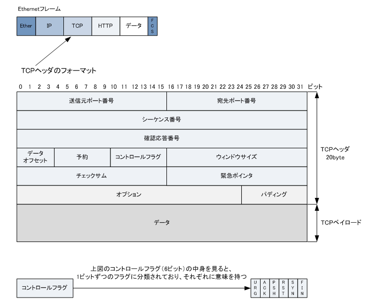
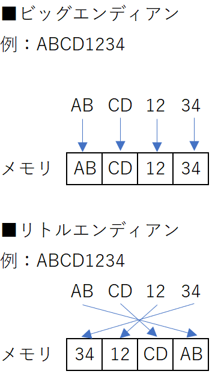

# toy-tcp

- [GitHub](https://github.com/teru01/toytcp)

---

## Memo

### TCPセグメント

**TCPセグメント**とは、TCPで送受信されるデータの伝送単位。先頭部分が制御情報を記したTCPヘッダ、残りが伝送データ本体を格納したTCPペイロードで、IPデータグラムのペイロード部に格納されて運ばれる。

TCP（Transmission Control Protocol）はIP（Internet Protocol）と併用されるトランスポート層のプロトコル（通信手順）で、HTTPやSMTPなど上位層のデータを高い確実性で相手方に送り届ける役割を担う。

先頭のヘッダ部にはTCPの伝送に必要な制御情報が記される。送信元ポート番号や宛先ポート番号、シーケンス番号、確認応答番号、ウィンドウサイズ、制御フラグ、チェックサムなどが含まれる。フラグの状態によってセグメントが伝達する情報が異なり、ACKパケット、SYNパケット、RSTパケットのように呼び分けることがある。

後続のペイロード部には、HTTPなど上位層のプロトコルから伝送を依頼されたデータを積載する。データが大きい場合、ウィンドウサイズで示される均等な大きさに分割され、順序を示すシーケンス番号を付されて複数のTCPセグメントとして伝送される。

TCPは信頼性の高いプロトコルであり、シーケンス番号と確認応答番号により各セグメントの順序が分かり、チェックサムによりペイロード部のデータの誤りを検出できる。伝送経路の都合で順序が入れ替わってしまった場合でも受信側で本来の順序通りに組み立て直すことができ、伝送途上でセグメントが欠落したりペイロードが誤っている場合は再送要求を送ることができる。

|フィールド名|ビット数|説明|
|:--:|:--:|:--:|
|送信元ポート番号|16bit|送信元のポート番号の値。|
|宛先ポート番号|16bit|宛先のポート番号の値。|
|シーケンス番号|32bit|データの順序を示す値。「相手から受信した確認応答番号」の値。|
|確認応答番号|32bit|確認応答番号の値。「相手から受信したシーケンス番号」＋「データサイズ」。|
|データオフセット|4bit|TCPヘッダの長さを示す値。|
|予約|6bit|全ビット「0」が入る。将来の拡張のために用意されている。|
|コントロールフラグ|6bit|URG、ACK、PSH、RST、SYN、FINの6つのビットで構成されている。これらのビットは「1」の値が入る（フラグを立てる）場合に意味をなす。|
|ウィンドウサイズ|16bit|受信側が一度に受信することができるデータ量を送信側に通知するために使用される。送信側は、この値のデータ量を超えて送信することはできない。|
|チェックサム|16bit|TCPヘッダとデータ部分のエラーチェックを行うために使用される値が入る。|
|緊急ポインタ|16bit|コントロールフラグのURGの値が「1」である場合にのみ使用されるフィールド。緊急データの開始位置を示す情報が入る|
|オプション|可変長|TCPの通信において、性能を向上させるために利用する。例えば、TCPコネクションの際に、MSSを決定するために使用されたりします。
|パディング|可変長|TCPヘッダの長さを32ビットの整数にするために詰め物(Padding)として空データの 「 0 」 の値を入れることにより調整する。|

以下の表は、TCPヘッダのフィールドにある「コントロールフラグ」の6 bitの詳細となります。

|ビット|値が「1」である（フラグが立っている）時の意味|
|:--:|:--:|
|URG (Urgent)|緊急に処理すべきデータ含まれていることを意味する。|
|ACK (Acknowledgement)|確認応答番号のフィールドが有効であることを意味する。コネクション確立時以外は値が「1」。|
|PSH ( Push )|受信したデータをバッファリングせずに、即座にアプリケーション（上位）に渡すことを意味する。|
|RST ( Reset )|コネクションが強制的に切断されることを意味する。何らかの異常を検出した場合に送信される。|
|SYN ( Synchronize )|コネクションの確立を要求することを意味する。|
|FIN ( Fin )|コネクションの正常な終了を要求することを意味する。|

これらのTCPヘッダの値はTCPの特徴である「ポート番号を使用」、「コネクションの確立、維持切断」
　「順序制御」、「再送制御」、「ウィンドウ制御」、「フロー制御」で、しっかりと生かされています。

参考：
- [TCP/IP - TCP header](https://www.infraexpert.com/study/tcpip8.html)
- [ネットワークの基礎講座](https://www.cresc.co.jp/tech/network/NET_TUTORIAL/Section_42.htm)

---

### エンディアン(バイト単位で見た時のデータの並び順)

- 予備知識

|用語|意味|
|:--:|:--:|
|データ|-|
|ビット|情報の機本単位。0か1で表現される|
|バイト|1byte = 8bit|
|エンディアン|複数のバイトで構成されるデータを取り扱うときの並び順のこと|

- ビッグエンディアンとリトルエンディアン

|用語|意味|
|:--:|:--:|
|ビッグエンディアン|上位バイトから下位バイトの順に取り扱う方式|
|リトルエンディアン|下位バイトから上位バイトの順に取り扱う方式|

